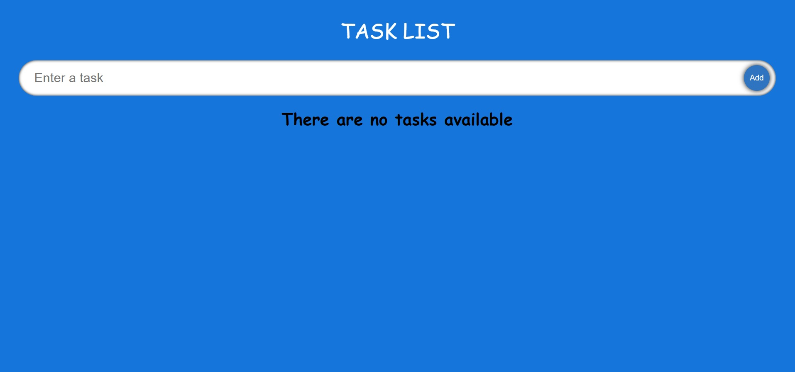
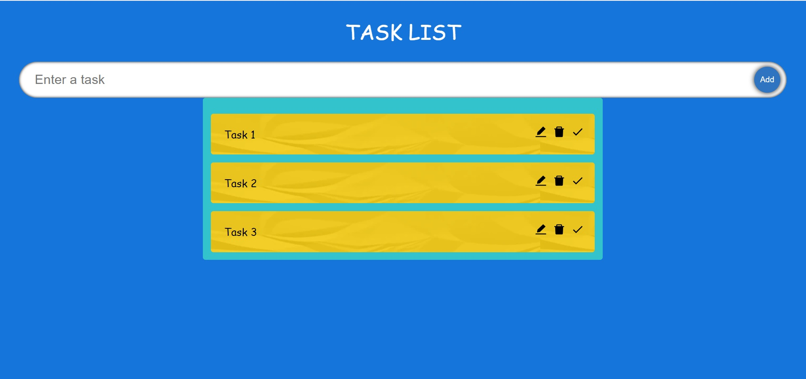
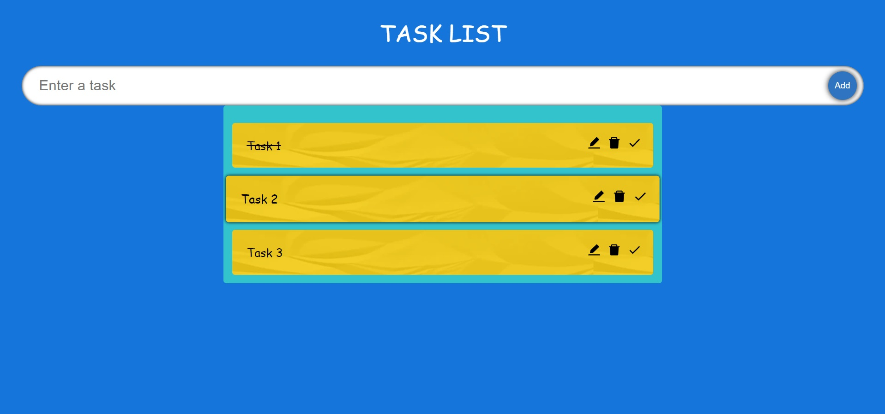
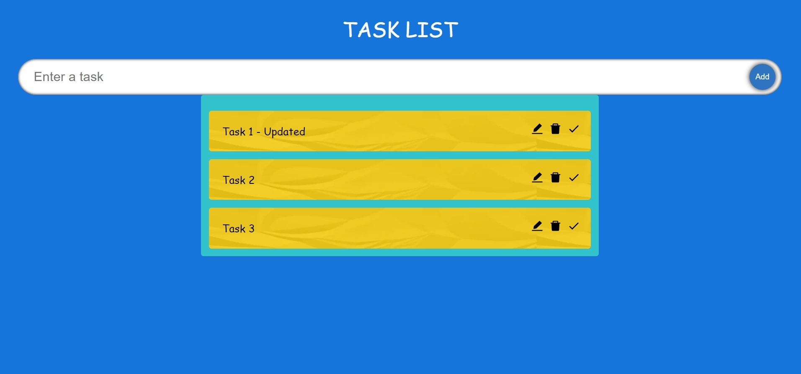
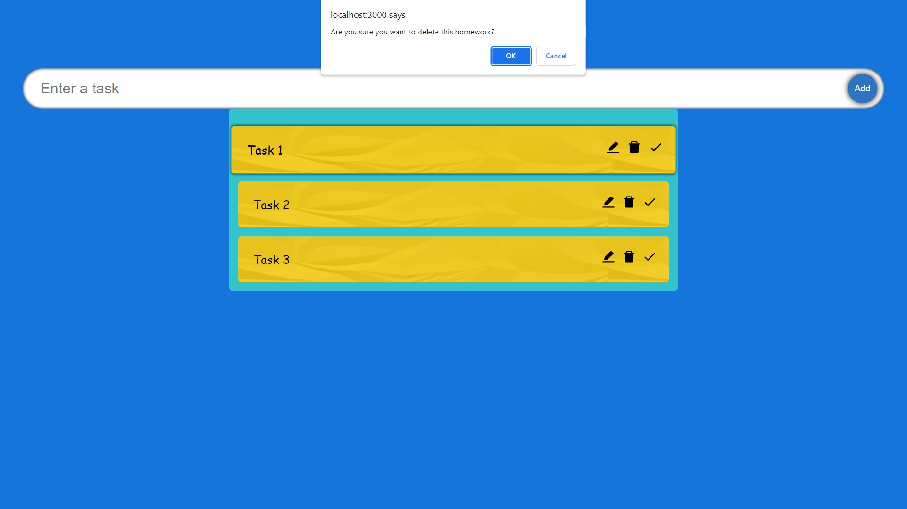

<h1 align="center"><i>Todo List</i></h1>

**_
Simple React application with Typescript. There is an option to add notes as well as to mark them as completed. They can be edited as well as deleted. The application also has a responsive design.
_**

    

    <h2 align="center">Initial render</h2>
    
    

    <h2 align="center">Add tasks</h2>
    
    

    <h2 align="center">Done task</h2>
    
    

    <h2 align="center">Edit task</h2>
    
    

     <h2 align="center">Delete task</h2>
    
    

    

<h2>Setup:</h2>
- <i><b>Download or clone the repository</b></i> 
- <i><b>To start: run npm start</b></i>

Used features of the platform:

- <i><b>Responsive Design</b></i>
- <i><b>Add unlimited tasks</b></i>
- <i><b>Update current task</b></i>
- <i><b>Check done task</b></i>
- <i><b>Delete select task</b></i>

Used technologies:

- <i><b>JavaScript with React library</b></i>
- <i><b>TypeScript</b></i>
- <i><b>HTML</b></i>
- <i><b>CSS</b></i>

Dependencies, (besides Create-React-App deps): 

- React Icons
- uniqid
